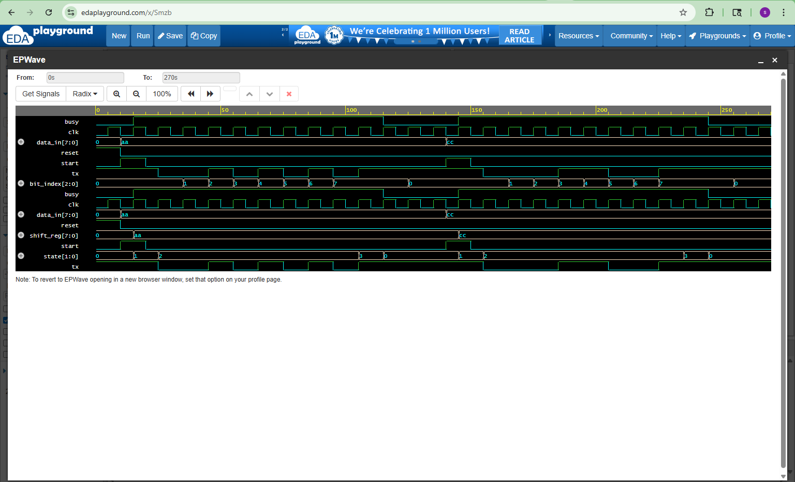

# UART Transmitter Design & Verification

## Overview
This project implements and verifies a UART transmitter using SystemVerilog.

UART stands for Universal Asynchronous Receiver/Transmitter. It is commonly used for serial communication between digital systems.

## Features
- UART transmit logic
- Start bit generation
- 8-bit data transmission
- Stop bit generation
- Busy signal
- FSM-based design

## Design (RTL)
The UART transmitter is implemented using a Finite State Machine (FSM) with four states:

- IDLE
- START
- DATA
- STOP

When start is asserted, the transmitter sends:
1. Start bit: 0
2. 8 data bits
3. Stop bit: 1

## Verification
A SystemVerilog testbench is used to:
- Apply reset
- Generate clock
- Send multiple 8-bit data values
- Verify UART transmit behavior
- Generate waveform output

## Tools Used
- SystemVerilog
- EDA Playground
- Icarus Verilog
- EPWave

## Waveform

Below waveform shows UART start bit, data bits, stop bit, and busy signal behavior.

## Simulation Output

Sending Data: 10101010  
Transmission Done for: 10101010  
Sending Data: 11001100  
Transmission Done for: 11001100  
UART transmission completed.
